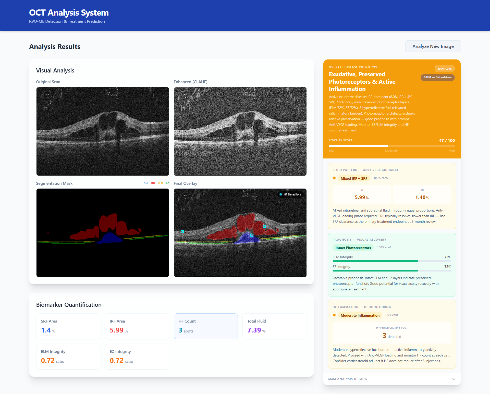
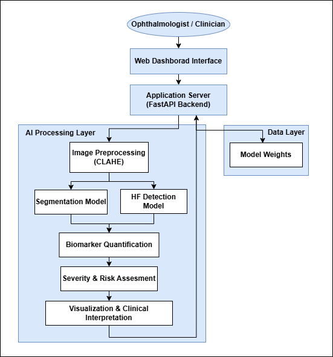
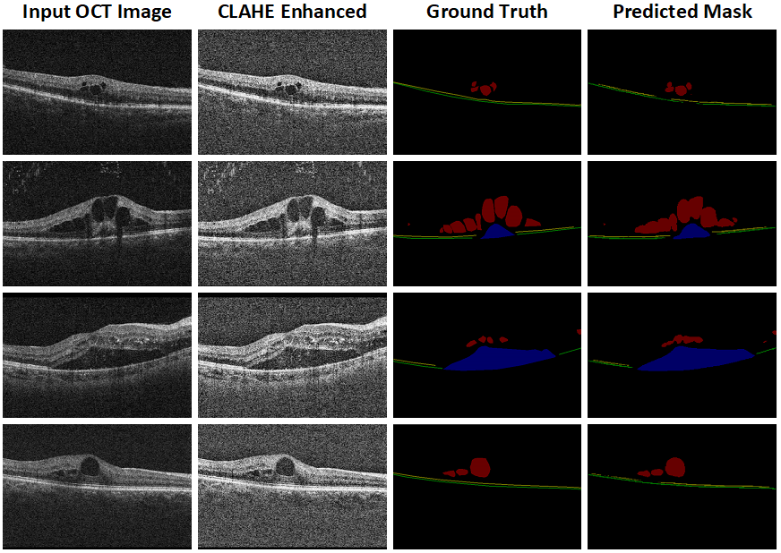
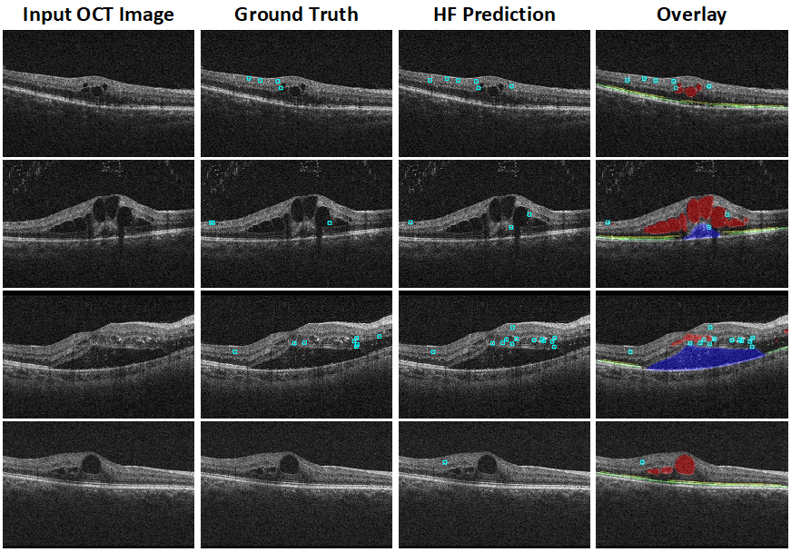

# 👁️ Macular AI

**An AI-powered clinical decision support system for automated OCT analysis in Retinal Vein Occlusion with Macular Edema (RVO-ME)**


---

## 📖 Overview

A patient with **Retinal Vein Occlusion with Macular Edema (RVO-ME)** requires a specialist to manually read an OCT (Optical Coherence Tomography) scan, locate fluid accumulation, check photoreceptor layer integrity, count inflammatory lesions, and decide on treatment — a process that is slow, expertise-dependent, and prone to inter-observer variability.

**Macular AI** automates this entire workflow. A single OCT B-scan is uploaded and, within seconds, the system returns retinal biomarker segmentation, lesion detection, quantified clinical metrics, disease phenotype classification, and a treatment recommendation — end to end, with no manual measurement required.

<p align="center">

</p>

<p align="center"><i>Fig. 1. Macular AI clinical dashboard visualization.</i></p>

---

## ✨ Key Features

- 🧠 **Multi-class retinal biomarker segmentation** (SRF, IRF, ELM, EZ) via Attention U-Net
- 🎯 **Hyperreflective Foci (HF) detection** via Faster R-CNN with small-object anchors
- 📏 **Automated biomarker quantification** — fluid area, layer integrity, lesion count
- ⚕️ **Rule-based severity grading** (Normal / Mild / Moderate / Severe)
- 🧬 **Four independent GMM phenotyping models** for disease characterization, fluid pattern, prognosis, and inflammation
- 💻 **Interactive clinical dashboard** with segmentation overlays and automated report generation
- ⚡ **FastAPI + React** full-stack deployment, single endpoint, ~1–5 second inference

---

## 🏗️ System Architecture

<p align="center">

</p>

<p align="center"><i>Fig. 2. Architecture of the proposed Macular AI framework for automated RVO-ME analysis.</i></p>

### Pipeline

```
OCT B-scan (any format)
        │
        ▼
[1] CLAHE Contrast Enhancement        (clip limit 2.0, tile grid 8×8)
        │
        ▼
[2] Attention U-Net Segmentation      (5-class pixel mask: BG, SRF, IRF, ELM, EZ)
        │
        ▼
[3] Faster R-CNN Detection            (Hyperreflective Foci bounding boxes)
        │
        ▼
[4] Biomarker Quantification          (fluid area %, layer integrity, HF count)
        │
        ▼
[5] Rule-Based Severity Assessment    (Normal / Mild / Moderate / Severe)
        │
        ▼
[6] GMM-Based Disease Phenotyping     (Overall, Fluid, Prognosis, Inflammation)
        │
        ▼
[7] Overlay Visualization + Report    (base64 PNGs + structured JSON)
```

---

## 🧠 Models

| Stage | Model | Backbone / Method | Parameters |
|-------|-------|--------------------|------------|
| Preprocessing | CLAHE | OpenCV adaptive histogram equalization | — |
| Segmentation | Attention U-Net | Encoder-decoder + attention gates on skip connections | ~34.9M |
| Detection | Faster R-CNN | ResNet-50 + FPN, custom small-object anchors | ~41M |
| Phenotyping | 4× Gaussian Mixture Models | Overall, Fluid, Prognosis, Inflammation | — |

**Retinal biomarker classes segmented:**

| Class ID | Biomarker | Description |
|:--------:|-----------|--------------|
| 0 | Background | Non-retinal tissue |
| 1 | SRF | Subretinal Fluid |
| 2 | IRF | Intraretinal Fluid |
| 3 | ELM | External Limiting Membrane |
| 4 | EZ | Ellipsoid Zone (photoreceptor layer) |

---

## 📊 Dataset

Trained and evaluated on the **RVO-Lesion OCT dataset** (Xiong et al., *Scientific Data*, 2026).

| Property | Value |
|----------|-------|
| Total OCT B-scans | 3,012 |
| Total patients | 146 |
| Training images / patients | 2,415 / 117 |
| Test images / patients | 597 / 30 |
| Semantic classes | 5 |
| Annotation type | Pixel segmentation + HF point annotations |
| Split granularity | Patient-level (no patient overlap between train/test) |

---

## 📈 Results

### Retinal Biomarker Segmentation (test set, n = 597)

| Class | Dice (%) | IoU (%) | Precision (%) | Recall (%) | Specificity (%) |
|-------|---------:|--------:|---------------:|-----------:|-----------------:|
| SRF | **88.62** | 79.57 | 79.89 | 99.50 | 99.57 |
| IRF | **81.12** | 68.24 | 71.98 | 92.91 | 98.95 |
| ELM | 54.42 | 38.55 | 51.26 | 58.12 | 99.90 |
| EZ | 59.38 | 42.79 | 57.41 | 51.52 | 99.83 |

| Aggregate Metric | Value |
|-------------------|------:|
| Mean Dice (excl. background) | 65.89% |
| mIoU (excl. background) | 52.29% |
| Overall Pixel Accuracy | 97.88% |
| Cohen's Kappa | 0.802 |

<p align="center">

</p>

<p align="center"><i>Fig. 3. Qualitative retinal biomarker segmentation results. From left to right: original OCT image, CLAHE-enhanced image, ground truth, and predicted segmentation mask. SRF is shown in blue, IRF in red, ELM in green, and EZ in yellow.</i></p>

### Hyperreflective Foci Detection

| Metric | Value |
|--------|------:|
| AP @ IoU = 0.50 | 0.6349 |
| AP (small objects) | 0.5751 |
| Precision | 82.14% |
| Recall | 78.54% |
| F1-Score | 0.6418 |

<p align="center">

</p>

<p align="center"><i>Fig. 4. Qualitative Hyperreflective Foci (HF) detection results. From left to right: original OCT image, ground-truth HF annotations, predicted HF detections, and overlay visualization. Cyan boxes indicate HF lesions, while SRF, IRF, ELM, and EZ are shown in blue, red, green, and yellow, respectively.</i></p>

### Clinical Severity Interpretation

| Severity | Clinical Characteristics |
|----------|---------------------------|
| Normal | No pathological retinal findings |
| Mild | Small fluid regions or few HF lesions |
| Moderate | Moderate retinal edema and layer disruption |
| Severe | Extensive fluid accumulation and severe retinal damage |

### GMM Disease Phenotyping

| Predictor | Feature Subspace | Clinical Purpose |
|-----------|-------------------|-------------------|
| Overall | IRF, SRF, ELM, EZ, HF density | Global disease characterization |
| Fluid | SRF, IRF | Fluid pattern analysis (IRF/SRF-dominant, mixed, minimal) |
| Prognosis | ELM, EZ integrity | Visual recovery / structural preservation estimation |
| Inflammation | HF density | Inflammatory activity grading (low / moderate / high) |

---

## 🛠️ Tech Stack

| Layer | Technology |
|-------|------------|
| Deep Learning | PyTorch, torchvision |
| Image Processing | OpenCV, NumPy, Pillow |
| Phenotyping | scikit-learn (GaussianMixture, StandardScaler) |
| Backend | FastAPI, Uvicorn |
| Frontend | React 19, Vite, Tailwind CSS |

---

## 🔌 API

```
POST /api/analyze
Content-Type: multipart/form-data
Field: file (image/*)
```

**Response (abridged):**

```json
{
  "original_image": "data:image/png;base64,...",
  "enhanced_image": "data:image/png;base64,...",
  "segmentation_mask": "data:image/png;base64,...",
  "overlay_image": "data:image/png;base64,...",
  "metrics": {
    "srf_area_percent": 0.0,
    "irf_area_percent": 0.0,
    "total_fluid_area_percent": 0.0,
    "hf_count": 0,
    "elm_integrity": 0.0,
    "ez_integrity": 0.0
  },
  "phenotyping": {
    "overall": { "cluster": 0, "label": "...", "severity_score": 0.0 },
    "fluid": { "cluster": 0, "severity": "...", "recommendation": "..." },
    "prognosis": { "cluster": 0, "tier": "...", "outlook": "..." },
    "inflammation": { "cluster": 0, "level": "...", "recommendation": "..." },
    "explanation": "...",
    "ml_mode": true
  }
}
```

`GET /api/health` → health check. Interactive Swagger docs at `http://localhost:8000/docs`.

---

## 📂 Project Structure

```
Macular-AI/
├── backend/
│   ├── app/
│   │   ├── main.py                 # FastAPI app, startup, CORS
│   │   ├── routes/analysis.py      # POST /api/analyze
│   │   ├── models/                 # AttentionUNet, Faster R-CNN factory
│   │   ├── services/               # preprocessing, inference, quantification, GMM pipeline
│   │   └── utils/visualization.py  # overlay rendering
│   ├── detection/                  # LabelMe→COCO conversion, training, dataset
│   ├── phenotyping/                # GMM training
│   ├── evaluation/                 # Dice/IoU/AP/FROC evaluation scripts
│   └── weights/                    # trained model artifacts
├── frontend/
│   ├── src/components/             # ImageUploader, ResultsPanel, MetricsDisplay, PhenotypingCard
│   └── src/services/api.js
├── images/
│   ├── pipeline_architecture.png    # Fig. 1 — system architecture
│   ├── segmentation_results.png     # Fig. 2 — qualitative segmentation output
│   ├── hf_detection_results.png     # Fig. 3 — qualitative HF detection output
│   └── dashboard_results.png        # Fig. 4 — clinical dashboard
└── README.md
```

---

## 🚀 Getting Started

```bash
# Backend
cd backend
pip install -r requirements.txt
uvicorn app.main:app --reload

# Frontend
cd frontend
npm install
npm run dev
```

---

## ⚠️ Limitations

- ELM/EZ segmentation Dice (~0.44–0.59) reflects the intrinsic difficulty of thin, 1–3 pixel photoreceptor layers rather than a model shortcoming; column-coverage integrity metrics are used as the clinically robust indicator instead.
- HF ground truth derives from 10×10 px proxy boxes around point annotations, making AP@0.75 non-meaningful.
- GMM phenotyping is trained on a single-centre, 146-patient cohort and has not yet been validated against clinician-labeled phenotypes.
- The system analyzes individual B-scans, not full volumetric OCT cubes.

